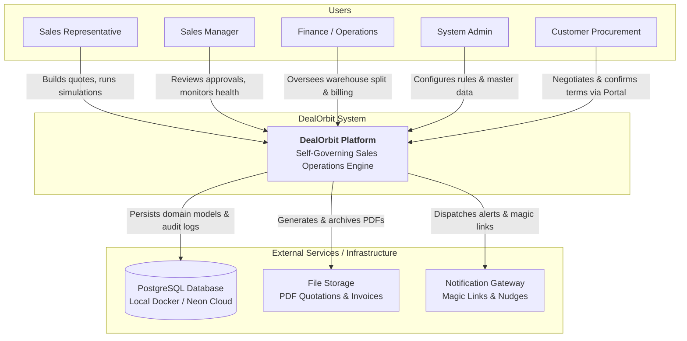
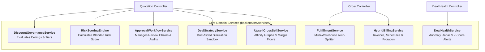
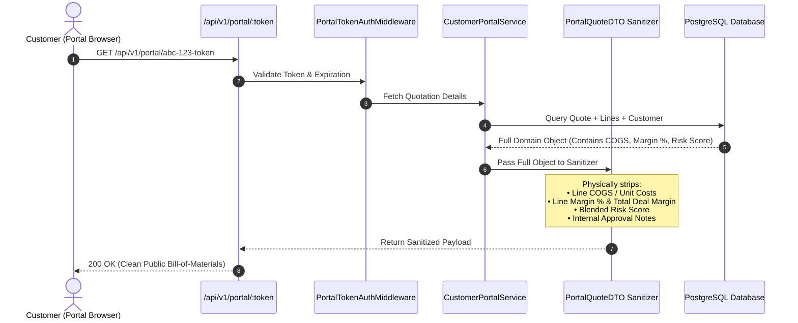
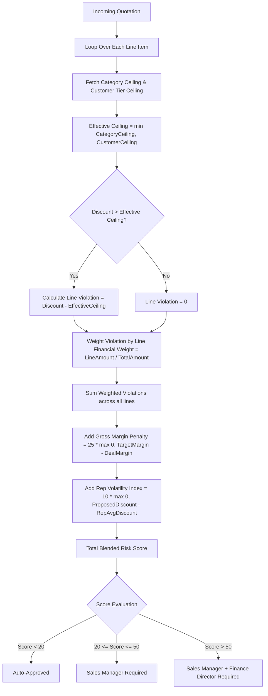
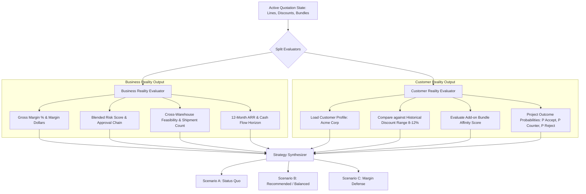
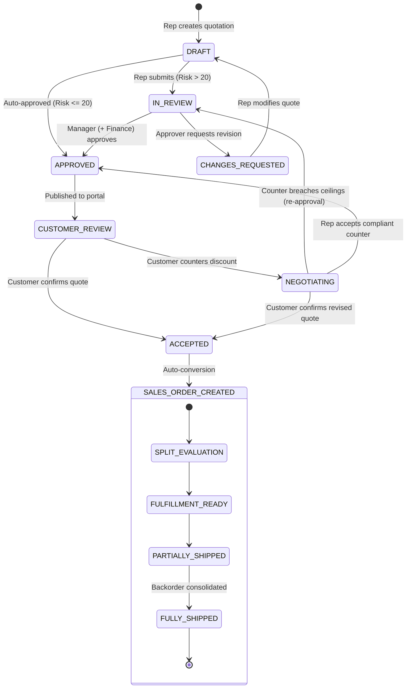

# DealOrbit — System Architecture & Technical Design

> **Document Version:** 1.0.0  
> **Status:** Approved / Base Specification  
> **Target System:** DealOrbit (Intelligent, Self-Governing Sales Operations Platform)  
> **Tech Stack:** Next.js 16 (React 19, TypeScript, Tailwind CSS v4) + Node.js/Express (Clean Architecture) + PostgreSQL (Prisma ORM) + Docker Compose

---

## 1. Architectural Overview & System Tenets

DealOrbit is engineered as a high-performance, modular fullstack platform adhering to **Clean Layered Architecture** principles on the backend and **Modern React Server/Client Component Separation** on the frontend. 

The architecture is designed around three non-negotiable engineering tenets:
1. **Real Business Logic (Zero Mocking):** All calculations—Blended Risk Scoring, Multi-Warehouse Splitting, Subscription Proration, and Dual-Sided Simulations—are executed by deterministic, testable server-side domain services.
2. **Server-Enforced Data Isolation (Zero Leakage):** The restricted Customer Portal communicates through dedicated, data-masked DTOs (Data Transfer Objects). Internal costs (COGS), margins, and risk scores are physically stripped at the controller layer before leaving the API boundary.
3. **Optimistic Concurrency & Audit Integrity:** The living quotation uses version-locked optimistic concurrency. Every state change, approval decision, rejection, and counter-offer is committed to an immutable append-only audit ledger.

---

## 2. High-Level Architecture (C4 Model)

### 2.1 Level 1: System Context Diagram



---

### 2.2 Level 2: Container Diagram (Fullstack Runtime Topology)

```
┌─────────────────────────────────────────────────────────────────────────────┐
│                          DOCKER COMPOSE NETWORK                             │
│                                                                             │
│  ┌───────────────────────────────────────────────────────────────────────┐  │
│  │                    FRONTEND CONTAINER (Next.js 16)                    │  │
│  │  Port 3000 | App Router | React 19 | Tailwind CSS v4 | TypeScript     │  │
│  │                                                                       │  │
│  │  ┌──────────────────┐  ┌───────────────────┐  ┌────────────────────┐  │  │
│  │  │ Internal Sales   │  │ Deal Strategy     │  │ Restricted         │  │  │
│  │  │ Workspace UI     │  │ Simulator Sandbox │  │ Customer Portal UI │  │  │
│  │  └────────┬─────────┘  └─────────┬─────────┘  └─────────┬──────────┘  │  │
│  └───────────┼──────────────────────┼──────────────────────┼─────────────┘  │
│              │                      │                      │                │
│              │ REST API Requests (/api/v1/*) with Bearer / Portal Token     │
│              ▼                      ▼                      ▼                │
│  ┌───────────────────────────────────────────────────────────────────────┐  │
│  │                    BACKEND CONTAINER (Node.js / Express)              │  │
│  │  Port 5000 | Clean Layered Architecture | Express 4.x | TypeScript   │  │
│  │                                                                       │  │
│  │  ┌─────────────────────────────────────────────────────────────────┐  │  │
│  │  │ Routing & Middleware Layer (Auth Guard, RBAC, Masking DTO)       │  │  │
│  │  └────────────────────────────────┬────────────────────────────────┘  │  │
│  │                                   ▼                                   │  │
│  │  ┌─────────────────────────────────────────────────────────────────┐  │  │
│  │  │ Controllers Layer (Request Validation, Async Handler, Responses) │  │  │
│  │  └────────────────────────────────┬────────────────────────────────┘  │  │
│  │                                   ▼                                   │  │
│  │  ┌─────────────────────────────────────────────────────────────────┐  │  │
│  │  │ Domain Services Layer (Governance, Simulation, Splitter, Billing)│  │  │
│  │  └────────────────────────────────┬────────────────────────────────┘  │  │
│  │                                   ▼                                   │  │
│  │  ┌─────────────────────────────────────────────────────────────────┐  │  │
│  │  │ Repositories Layer (Prisma Data Access & ACID Transactions)     │  │  │
│  │  └────────────────────────────────┬────────────────────────────────┘  │  │
│  └───────────────────────────────────┼───────────────────────────────────┘  │
│                                      │                                       │
│                                      │ Connection Pool (Prisma Client)       │
│                                      ▼                                       │
│  ┌───────────────────────────────────────────────────────────────────────┐  │
│  │                    DATABASE CONTAINER (PostgreSQL 16)                 │  │
│  │  Port 5432 | Relational Schema | ACID Guarantees | Local / Neon Cloud │  │
│  └───────────────────────────────────────────────────────────────────────┘  │
└─────────────────────────────────────────────────────────────────────────────┘
```

---

## 3. Backend Architecture: Clean Layered Design

The backend strictly separates responsibilities into four concentric layers. Dependencies flow **unidirectionally downward**:
$$\text{Routes} \longrightarrow \text{Controllers} \longrightarrow \text{Services} \longrightarrow \text{Repositories} \longrightarrow \text{Prisma Client / Database}$$

```
backend/src/
├── config/             # Environment variables, DB pool, constants
├── middlewares/        # Authentication, RBAC, error handling, rate limiting
├── routes/             # Endpoint definitions and route mounting
├── controllers/        # Request extraction, input validation, HTTP response
├── services/           # Pure business logic, algorithms, calculation engines
├── repositories/       # Data persistence abstraction, Prisma queries
├── utils/              # Calculation helpers, mathematical formulas, logger
└── types/              # TypeScript interfaces, DTOs, Enums
```

### 3.1 Layer Breakdown & Responsibilities

| Layer | Responsibility | Allowed Dependencies | Forbidden Actions |
| :--- | :--- | :--- | :--- |
| **1. Routes** | URL routing, HTTP method binding, middleware pipeline attachment. | Middlewares, Controllers. | No business logic, no direct DB queries. |
| **2. Controllers** | Input validation (Zod schemas), extracting parameters, invoking services, formatting JSON responses. | Services, Types/DTOs. | No database access, no business calculations. |
| **3. Services** | **The Core Brain:** Pricing rules, risk scoring, simulation algorithms, warehouse split logic, proration math. | Repositories, Utils, Domain Types. | No HTTP request/response objects (`req`, `res`). Must be framework-agnostic. |
| **4. Repositories** | Prisma ORM queries, database transactions (`$transaction`), pagination, query optimization. | Prisma Client, Database Config. | No business logic rules or calculations. |

---

### 3.2 Domain Services Architecture (The Core Engine Modules)



#### Detailed Service Specifications:

1. **`DiscountGovernanceService` & `RiskScoringEngine`:**
   * Ingests quotation lines and customer tier rules.
   * Compares each line discount against both customer tier ceiling and category-specific ceiling.
   * Computes the **Blended Discount Risk Score** combining weighted discount overage, gross margin erosion, and rep volatility factor.
   * Determines approval requirements (`AUTO_APPROVED`, `MANAGER_REQUIRED`, `FINANCE_REQUIRED`).

2. **`ApprovalWorkflowService`:**
   * Manages approval state transitions: `IN_REVIEW` $\rightarrow$ `APPROVED` / `REJECTED` / `CHANGES_REQUESTED`.
   * Enforces sequential progression: Sales Manager approval automatically unlocks Finance Director queue if score $> 50$.
   * Records immutable audit records (`ActorUserId`, `Timestamp`, `Action`, `Reason`).
   * Handles **mutation invalidation**: revokes active approval if any line item, discount, or quantity is altered.

3. **`DealStrategyService` & `SimulationEngine` (The Innovation Core):**
   * **Business Reality Evaluator:** Simulates gross margin %, net profit, risk score, approval requirements, and warehouse shipment counts for arbitrary What-If parameter variations.
   * **Customer Reality Evaluator:** Ingests the customer's grounded behavioral profile (historical discount range $8-12\%$, category price elasticity, service affinity) and calculates response probabilities ($P(\text{Accept})$, $P(\text{Negotiate})$, $P(\text{Reject})$).
   * **Scenario Synthesizer:** Generates and compares **Scenario A (Status Quo)**, **Scenario B (Recommended)**, and **Scenario C (Margin Defense)**.

4. **`UpsellCrossSellService`:**
   * Analyzes active cart SKUs against co-purchase affinity tables.
   * Filters suggestions against the configured margin safety floor ($18\%$).
   * Calculates immediate margin delta ($\Delta\%$) and attaches promotional boost rankings.

5. **`FulfillmentService`:**
   * **Quotation Check:** Evaluates aggregate stock availability across all regional warehouses to warn of stockouts during quoting.
   * **Order Splitting:** Implements a greedy optimization algorithm that minimizes total shipment count weighted by warehouse logistics cost multipliers.
   * **Backorder Consolidator:** Splits unfulfillable balances into linked `BACKORDER` records and handles the "Consolidate Remaining Backorder" event when replenishment inventory arrives.

6. **`HybridBillingService`:**
   * Splits confirmed orders into two distinct financial tracks:
     * One-time lines $\rightarrow$ Immediate Commercial Invoice.
     * Recurring lines $\rightarrow$ Subscription Contract with recurring billing schedules (Monthly, Quarterly, Annually).
   * **Proration Engine:** Computes mid-term adjustments via exact day-count formulation:
     $$\Delta \text{Charge} = \left( \frac{D_{\text{remaining}}}{D_{\text{total}}} \right) \times (\text{NewRate} - \text{OldRate})$$
   * Issues credit notes and ledger adjustments for contract cancellations.

7. **`DealHealthService`:**
   * Runs anomaly detection algorithms across the quotation pipeline.
   * Computes rep discount deviation Z-scores ($Z = \frac{x - \mu}{\sigma}$) to catch anomalous discounting patterns ($> 2.5\sigma$).
   * Identifies stalled quotations ($> 7$ days inactive) and logistics delivery slippage.

---

## 4. Frontend Architecture: Next.js 16 App Router

The frontend is structured using Next.js 16 with the **App Router**, leveraging React 19 Server Components for high-performance data fetching and Client Components for dynamic, interactive deal-building and simulation.

```
frontend/
├── app/
│   ├── (auth)/                 # Authentication routes (login, signup)
│   │   ├── login/page.tsx
│   │   └── signup/page.tsx
│   ├── (workspace)/            # Internal Sales Workspace layout & navigation
│   │   ├── layout.tsx          # Top nav (Quotations, Pipeline, Reload, Backend)
│   │   ├── quotations/         # Quotation list & builder
│   │   │   ├── page.tsx        # Quotation list / search
│   │   │   ├── new/page.tsx    # Create quotation
│   │   │   └── [id]/page.tsx   # Quotation builder & simulator
│   │   ├── pipeline/page.tsx   # Kanban pipeline view
│   │   ├── approvals/page.tsx  # Manager & Finance approval inbox
│   │   ├── fulfillment/page.tsx# Operations multi-warehouse split screen
│   │   ├── billing/page.tsx    # Hybrid billing, subscriptions & proration
│   │   └── deal-health/page.tsx# Deal health radar & anomaly dashboard
│   ├── (portal)/               # Restricted Customer Portal
│   │   └── portal/[token]/     # Customer negotiation view (data-masked)
│   │       └── page.tsx
│   └── (admin)/                # Backend Configuration Area
│       └── admin/
│           ├── layout.tsx      # Admin sidebar navigation
│           ├── discount-rules/ # Tier & Category discount ceilings
│           ├── warehouses/     # Warehouses & stock replenishment
│           ├── subscriptions/  # Recurring plans & proration setup
│           ├── upsell-rules/   # Co-purchase rules & margin floor
│           └── reports/        # Sales performance analytics & PDF/XLS export
├── components/                 # Reusable UI component library
│   ├── ui/                     # Atoms: Button, Card, Badge, Modal, Input, Slider
│   ├── quotation/              # Quotation Builder, CartTable, MarginIndicator
│   ├── simulator/              # DealStrategyModal, ScenarioCard, RadarGauge
│   ├── approval/               # ApprovalInboxCard, RiskScoreMeter, AuditTimeline
│   ├── fulfillment/            # WarehouseSplitMatrix, BackorderPrompt
│   └── portal/                 # CustomerNegotiationThread, CounterOfferForm
├── hooks/                      # Custom hooks (useQuotation, useSimulation, useAuth)
├── lib/                        # API client, utility functions, formatting
└── types/                      # Frontend TypeScript interfaces
```

---

## 5. Security, RBAC & Customer Portal Data Masking

### 5.1 Role-Based Access Control (RBAC) Matrix

| Endpoint / Resource Area | Public / Customer | Sales Rep | Sales Manager | Finance / Ops | Admin |
| :--- | :---: | :---: | :---: | :---: | :---: |
| `/api/v1/admin/*` | ❌ | ❌ | ❌ | ❌ | ✅ |
| `/api/v1/quotations (Create/Edit)` | ❌ | ✅ | ✅ | ❌ | ✅ |
| `/api/v1/approvals/*` | ❌ | ❌ | ✅ | ✅ | ✅ |
| `/api/v1/fulfillment/*` | ❌ | ❌ | ❌ | ✅ | ✅ |
| `/api/v1/billing/*` | ❌ | ❌ | ❌ | ✅ | ✅ |
| `/api/v1/deal-health/*` | ❌ | ❌ | ✅ | ✅ | ✅ |
| `/api/v1/portal/:token/*` | ✅ (Token) | ❌ | ❌ | ❌ | ❌ |

---

### 5.2 Customer Portal Physical Data Masking Architecture

To comply with the official requirement that the customer-facing negotiation screen is a **genuinely separate, restricted view**, data sanitization occurs on the **backend API layer**, ensuring sensitive internal margins never traverse the network.



#### Sanitized Payload Contract (PortalQuoteDTO):
```json
{
  "quoteNumber": "QT-2026-0042",
  "version": "1.2",
  "customerName": "Acme Corp",
  "status": "CUSTOMER_REVIEW",
  "currency": "INR",
  "lineItems": [
    {
      "id": "line-01",
      "sku": "LAP-PRO-16",
      "description": "Enterprise Pro Laptop 16-inch",
      "quantity": 20,
      "unitPrice": 85000,
      "discountPercent": 10.0,
      "netPrice": 1530000
    }
  ],
  "subtotal": 1700000,
  "totalDiscount": 170000,
  "taxAmount": 275400,
  "grandTotal": 1805400,
  "paymentTerms": "Net 30",
  "expiresAt": "2026-04-01T00:00:00Z"
}
```

---

## 6. Algorithm & Calculation Engines Architecture

### 6.1 Blended Discount Risk Score Engine
The risk engine evaluates the **aggregate discount leakage pattern** across all lines rather than looking only at the single worst line:



---

### 6.2 Multi-Warehouse Fulfillment Splitting Engine
When a quotation converts to an order, the `FulfillmentService` executes a deterministic split algorithm:

```
Algorithm: OptimizeWarehouseSplit(OrderLines, Warehouses)
Input: OrderLines with SKU and Quantity Q; Warehouses with live Stock and ShippingCostWeight W
Output: ShipmentManifests with allocated quantities per warehouse

For each line in OrderLines:
  1. Check Single-Source Feasibility:
     Find warehouse w in Warehouses where Stock[w, SKU] >= Q with lowest W[w]
     If found:
       Allocate Q to warehouse w
       Continue to next line

  2. Multi-Source Greedy Allocation:
     RemainingQty = Q
     Sort Warehouses by Priority ASC, ShippingCostWeight ASC
     For each w in Warehouses:
       Available = min(Stock[w, SKU], RemainingQty)
       If Available > 0:
         Allocate Available to warehouse w
         RemainingQty = RemainingQty - Available
       If RemainingQty == 0: Break

  3. Backorder Generation:
     If RemainingQty > 0:
       Create BACKORDER record for RemainingQty
       Emit SHORTAGE_ALERT event
```

---

### 6.3 Dual-Sided Deal Strategy & Customer Simulation Engine



---

## 7. State Machine & Lifecycle Transitions

The Living Quotation and Sales Order lifecycle is governed by a strict deterministic state machine:



---

## 8. Database Architecture & Concurrency Strategy

* **ORM & Database:** Prisma ORM communicating with PostgreSQL 16.
* **Optimistic Locking:** The `quotations` table includes an integer `version` column. Every update query executes:
  ```sql
  UPDATE quotations 
  SET status = $new_status, version = version + 1 
  WHERE id = $quote_id AND version = $current_version;
  ```
  If zero rows are updated, the request aborts with `409 Conflict: Quote was updated concurrently`.
* **ACID Transactions:** Order creation, warehouse split allocations, and hybrid invoice generation execute inside `prisma.$transaction([...])` blocks to eliminate partial state corruption.
* **Seed Dataset:** The database initializes with:
  * 3 Customer accounts: `Acme Corp` (Gold), `Beta Industries` (Silver), `Gamma Tech` (Bronze).
  * 15 Catalog items spanning Hardware, Software Licenses, and Support Services.
  * 3 Warehouses: `Main Central Hub`, `East Depot`, `West Hub`.

---

## 9. DevOps, Tooling & Verification Runbook

### 9.1 Local Docker Development Stack
The system runs via single-command Docker Compose:
```yaml
version: '3.8'
services:
  postgres:
    image: postgres:16-alpine
    ports: ["5432:5432"]
    environment:
      POSTGRES_USER: postgres
      POSTGRES_PASSWORD: password
      POSTGRES_DB: deal_orbit
    volumes: [pgdata:/var/lib/postgresql/data]

  backend:
    build: ./backend
    ports: ["5000:5000"]
    env_file: ./backend/.env
    depends_on: [postgres]

  frontend:
    build: ./frontend
    ports: ["3000:3000"]
    env_file: ./frontend/.env
    depends_on: [backend]

volumes:
  pgdata:
```

### 9.2 Verification Commands
* **Start local database:** `npm run db:up`
* **Push Prisma schema:** `npm run db:push`
* **Seed database:** `cd backend && npx prisma db seed`
* **Run full stack dev servers:** `npm run dev`
* **Health Check endpoint:** `GET http://localhost:5000/api/v1/health`

---

## 10. Document Interoperability & Next Steps

This architecture document provides the engineering structure for DealOrbit. The remaining documents in the sequence build directly upon these specifications:
1. `PRD.md` — Complete Product Requirements & Innovation Framework *(Completed)*.
2. `User_flows.md` — Persona User Stories & Step-by-Step State Machines *(Completed)*.
3. `Architecture.md` — Clean Layered System Architecture & Calculation Engines *(Completed)*.
4. **`Database.md`** *(Next Up)* — Exhaustive Prisma Schema, PostgreSQL Tables, Enums, Foreign Keys, Indexes, and Seed Data.
5. `API.md` — RESTful Endpoint Contracts, Request/Response Schemas, Status Codes, and Error Payloads.
6. `Features.md` — Functional Feature Breakdown, Technical Specifications, and Acceptance Matrices.
7. `Memory.md` — Session Governance, Audit Logging, Simulation Caching, and Persistence Conventions.
8. `Pages.md` — Frontend View Architecture, Layout Components, Route Trees, and Wireframes.
