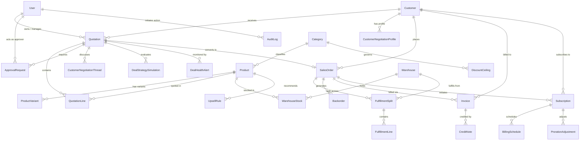

# DealOrbit — Database Architecture & Data Model (Database.md)

> **Document Version:** 1.0.0  
> **Status:** Approved / Base Specification  
> **Target Database:** PostgreSQL 16 (Relational, ACID-compliant)  
> **ORM Layer:** Prisma ORM 5.x / 6.x  
> **Direct Interoperability:** Implements data entities for all requirements specified in `PRD.md`, `User_flows.md`, and `Architecture.md`.

---

## 1. Database Architecture & Design Principles

The DealOrbit relational data model is designed around strict transactional integrity, high-performance querying, and physical security:

1. **Third Normal Form (3NF) with Strategic Denormalization:** Core business entities are strictly normalized to prevent data anomalies. Calculated metrics (e.g., `dealMarginPercent`, `blendedRiskScore`) are persisted on the `Quotation` record to provide immutable snapshots for auditing and rapid reporting queries.
2. **Optimistic Concurrency Locking:** The `quotations` table enforces an integer `version` counter incremented on every write, preventing race conditions between concurrent sales rep revisions and customer portal negotiations.
3. **Decimal Precision for Commercial Accuracy:** All monetary amounts, costs, unit prices, and percentages use PostgreSQL `Decimal(12, 2)` or `Decimal(5, 2)` to eliminate floating-point rounding errors.
4. **Append-Only Governance & Audit Trails:** Approval actions, status transitions, customer counter-offers, and proration adjustments write to dedicated append-only ledger tables (`audit_logs`, `approval_requests`, `proration_adjustments`).
5. **Physical Data Masking at Rest & Query Layer:** Foreign keys strictly link internal pricing and COGS, but portal-facing queries execute against restricted projections.

---

## 2. Entity Relationship Diagram (ERD)



---

## 3. Enumerated Types (Enums)

```prisma
enum Role {
  ADMIN
  SALES_REP
  SALES_MANAGER
  FINANCE_OPS
}

enum CustomerTier {
  BRONZE
  SILVER
  GOLD
  ENTERPRISE
}

enum ProductCategory {
  HARDWARE
  SOFTWARE
  SERVICES
}

enum QuoteStatus {
  DRAFT
  IN_REVIEW
  APPROVED
  CUSTOMER_REVIEW
  NEGOTIATING
  ACCEPTED
  CONVERTED_TO_ORDER
  REJECTED
  EXPIRED
}

enum ApprovalStatus {
  PENDING
  APPROVED
  REJECTED
  CHANGES_REQUESTED
  REVOKED_BY_MUTATION
}

enum OrderStatus {
  PENDING
  PROCESSING
  PARTIALLY_FULFILLED
  FULFILLED
  CANCELLED
}

enum FulfillmentStatus {
  PENDING
  READY_FOR_PICKING
  SHIPPED
  DELIVERED
}

enum BackorderStatus {
  PENDING
  REPLENISHED
  CONSOLIDATED
}

enum BillingFrequency {
  ONE_TIME
  MONTHLY
  QUARTERLY
  YEARLY
}

enum InvoiceType {
  COMMERCIAL_INVOICE
  PRORATION_ADJUSTMENT
}

enum InvoiceStatus {
  DRAFT
  SENT
  PAID
  OVERDUE
  CANCELLED
}

enum SubscriptionStatus {
  ACTIVE
  PAUSED
  MODIFIED
  CANCELLED
  EXPIRED
}

enum AlertType {
  STALLED_DEAL
  DISCOUNT_ANOMALY
  DELIVERY_SLIPPAGE
}

enum AlertSeverity {
  LOW
  MEDIUM
  HIGH
}
```

---

## 4. Complete Prisma Schema (`backend/prisma/schema.prisma`)

```prisma
generator client {
  provider = "prisma-client-js"
}

datasource db {
  provider  = "postgresql"
  url       = env("DATABASE_URL")
  directUrl = env("DIRECT_URL")
}

// ==========================================
// 1. IDENTITY, ACCESS & PROFILES
// ==========================================

model User {
  id            String    @id @default(uuid())
  email         String    @unique
  name          String
  passwordHash  String
  role          Role      @default(SALES_REP)
  isActive      Boolean   @default(true)
  historicalAvgDiscount Decimal @default(0.00) @db.Decimal(5, 2)
  createdAt     DateTime  @default(now())
  updatedAt     DateTime  @updatedAt

  refreshTokens    RefreshToken[]
  quotations       Quotation[]       @relation("RepQuotations")
  approvalRequests ApprovalRequest[] @relation("ApproverActions")
  auditLogs        AuditLog[]

  @@map("users")
}

model RefreshToken {
  id        String   @id @default(uuid())
  token     String   @unique
  userId    String
  expiresAt DateTime
  createdAt DateTime @default(now())

  user      User     @relation(fields: [userId], references: [id], onDelete: Cascade)

  @@map("refresh_tokens")
}

model Customer {
  id            String       @id @default(uuid())
  name          String
  code          String       @unique
  contactEmail  String
  contactPhone  String?
  tier          CustomerTier @default(BRONZE)
  paymentTerms  String       @default("Net 30") // e.g. "Net 30", "Net 60"
  isActive      Boolean      @default(true)
  createdAt     DateTime     @default(now())
  updatedAt     DateTime     @updatedAt

  negotiationProfile CustomerNegotiationProfile?
  quotations         Quotation[]
  salesOrders        SalesOrder[]
  invoices           Invoice[]
  subscriptions      Subscription[]

  @@map("customers")
}

model CustomerNegotiationProfile {
  id                      String   @id @default(uuid())
  customerId              String   @unique
  priceSensitivity        String   @default("HIGH") // "LOW", "MEDIUM", "HIGH"
  historicalMinDiscount   Decimal  @default(5.00)  @db.Decimal(5, 2)
  historicalMaxDiscount   Decimal  @default(12.00) @db.Decimal(5, 2)
  serviceAffinity         Decimal  @default(0.75)  @db.Decimal(3, 2) // 0.00 to 1.00
  paymentTermElasticity   String   @default("MEDIUM")
  averageResponseDays     Int      @default(4)
  notes                   String?
  updatedAt               DateTime @updatedAt

  customer                Customer @relation(fields: [customerId], references: [id], onDelete: Cascade)

  @@map("customer_negotiation_profiles")
}

// ==========================================
// 2. PRODUCT CATALOG & CONFIGURATION
// ==========================================

model Category {
  id                    String          @id @default(uuid())
  name                  ProductCategory @unique
  description           String?
  defaultCeilingDiscount Decimal        @default(10.00) @db.Decimal(5, 2)
  createdAt             DateTime        @default(now())
  updatedAt             DateTime        @updatedAt

  products              Product[]
  discountCeilings      DiscountCeiling[]

  @@map("categories")
}

model Product {
  id                  String          @id @default(uuid())
  sku                 String          @unique
  name                String
  categoryId          String
  basePrice           Decimal         @db.Decimal(12, 2)
  costPrice           Decimal         @db.Decimal(12, 2) // COGS (Confidential)
  unit                String          @default("Unit")  // "Unit", "Hours", "License"
  taxRate             Decimal         @default(18.00)   @db.Decimal(5, 2)
  description         String?
  isPromoted          Boolean         @default(false)
  minMarginThreshold  Decimal         @default(18.00)   @db.Decimal(5, 2)
  isRecurringDefault  Boolean         @default(false)
  defaultBillingCycle BillingFrequency @default(ONE_TIME)
  isActive            Boolean         @default(true)
  createdAt           DateTime        @default(now())
  updatedAt           DateTime        @updatedAt

  category            Category        @relation(fields: [categoryId], references: [id])
  variants            ProductVariant[]
  quotationLines      QuotationLine[]
  warehouseStock      WarehouseStock[]
  upsellSourceRules   UpsellRule[]    @relation("SourceProduct")
  upsellTargetRules   UpsellRule[]    @relation("TargetProduct")
  fulfillmentLines    FulfillmentLine[]
  backorders          Backorder[]

  @@map("products")
}

model ProductVariant {
  id             String          @id @default(uuid())
  productId      String
  attributeName  String          // e.g. "Size", "Memory", "Support Tier"
  attributeValue String          // e.g. "16GB", "32GB", "24x7 Dedicated"
  priceDelta     Decimal         @default(0.00) @db.Decimal(12, 2)
  costDelta      Decimal         @default(0.00) @db.Decimal(12, 2)
  skuModifier    String?
  createdAt      DateTime        @default(now())

  product        Product         @relation(fields: [productId], references: [id], onDelete: Cascade)
  quotationLines QuotationLine[]

  @@map("product_variants")
}

model UpsellRule {
  id                   String   @id @default(uuid())
  sourceProductId      String
  recommendedProductId String
  affinityScore        Decimal  @default(0.80) @db.Decimal(3, 2) // Co-purchase probability
  marginDeltaPercent   Decimal  @default(2.50) @db.Decimal(5, 2)
  promotionalTag       String?  // e.g. "PROMOTED", "FREQUENT_PAIRING"
  isActive             Boolean  @default(true)
  createdAt            DateTime @default(now())

  sourceProduct        Product  @relation("SourceProduct", fields: [sourceProductId], references: [id], onDelete: Cascade)
  recommendedProduct   Product  @relation("TargetProduct", fields: [recommendedProductId], references: [id], onDelete: Cascade)

  @@unique([sourceProductId, recommendedProductId])
  @@map("upsell_rules")
}

// ==========================================
// 3. GOVERNANCE & APPROVAL ENGINE
// ==========================================

model DiscountCeiling {
  id                String          @id @default(uuid())
  customerTier      CustomerTier
  categoryId        String
  maxDiscountPercent Decimal        @db.Decimal(5, 2)
  createdAt         DateTime        @default(now())
  updatedAt         DateTime        @updatedAt

  category          Category        @relation(fields: [categoryId], references: [id], onDelete: Cascade)

  @@unique([customerTier, categoryId])
  @@map("discount_ceilings")
}

model ApprovalChainRule {
  id               String   @id @default(uuid())
  minRiskScore     Decimal  @db.Decimal(5, 2)
  maxRiskScore     Decimal  @db.Decimal(5, 2)
  requiresManager  Boolean  @default(true)
  requiresFinance  Boolean  @default(false)
  description      String?

  @@map("approval_chain_rules")
}

model ApprovalRequest {
  id            String         @id @default(uuid())
  quotationId   String
  approverId    String?
  tierLevel     Int            @default(1) // 1 = Manager, 2 = Finance
  status        ApprovalStatus @default(PENDING)
  decisionReason String?
  requestedAt   DateTime       @default(now())
  decidedAt     DateTime?

  quotation     Quotation      @relation(fields: [quotationId], references: [id], onDelete: Cascade)
  approver      User?          @relation("ApproverActions", fields: [approverId], references: [id])

  @@map("approval_requests")
}

model AuditLog {
  id            String   @id @default(uuid())
  quotationId   String?
  salesOrderId  String?
  actorId       String?
  action        String   // e.g. "QUOTE_CREATED", "DISCOUNT_APPROVED", "COUNTER_RECEIVED"
  previousState String?
  newState      String?
  reason        String?
  metadataJson  Json?
  createdAt     DateTime @default(now())

  actor         User?    @relation(fields: [actorId], references: [id])

  @@map("audit_logs")
}

// ==========================================
// 4. LIVING QUOTATION & SIMULATION
// ==========================================

model Quotation {
  id                  String      @id @default(uuid())
  quoteNumber         String      @unique // e.g. "QT-2026-0001"
  version             Int         @default(1) // Optimistic locking
  customerId          String
  salesRepId          String
  status              QuoteStatus @default(DRAFT)
  paymentTerms        String      @default("Net 30")
  subtotalAmount      Decimal     @default(0.00) @db.Decimal(12, 2)
  totalDiscountAmount Decimal     @default(0.00) @db.Decimal(12, 2)
  taxAmount           Decimal     @default(0.00) @db.Decimal(12, 2)
  grandTotal          Decimal     @default(0.00) @db.Decimal(12, 2)
  totalCostBasis      Decimal     @default(0.00) @db.Decimal(12, 2) // Confidential COGS
  dealMarginPercent   Decimal     @default(0.00) @db.Decimal(5, 2)  // Confidential Margin
  blendedRiskScore    Decimal     @default(0.00) @db.Decimal(5, 2)  // Confidential Risk
  portalToken         String      @unique @default(uuid())
  portalTokenExpiresAt DateTime
  expiresAt           DateTime
  createdAt           DateTime    @default(now())
  updatedAt           DateTime    @updatedAt

  customer            Customer    @relation(fields: [customerId], references: [id])
  salesRep            User        @relation("RepQuotations", fields: [salesRepId], references: [id])
  lines               QuotationLine[]
  approvalRequests    ApprovalRequest[]
  negotiationThreads  CustomerNegotiationThread[]
  simulations         DealStrategySimulation[]
  healthAlerts        DealHealthAlert[]
  salesOrder          SalesOrder?

  @@index([customerId, status])
  @@index([salesRepId, status])
  @@index([portalToken])
  @@map("quotations")
}

model QuotationLine {
  id                String           @id @default(uuid())
  quotationId       String
  productId         String
  variantId         String?
  quantity          Int              @default(1)
  unitPrice         Decimal          @db.Decimal(12, 2)
  unitCost          Decimal          @db.Decimal(12, 2) // Confidential
  discountPercent   Decimal          @default(0.00) @db.Decimal(5, 2)
  effectiveCeiling  Decimal          @default(0.00) @db.Decimal(5, 2)
  isViolation       Boolean          @default(false)
  violationPoints   Decimal          @default(0.00) @db.Decimal(5, 2)
  netLinePrice      Decimal          @db.Decimal(12, 2)
  lineMarginPercent Decimal          @default(0.00) @db.Decimal(5, 2) // Confidential
  isRecurring       Boolean          @default(false)
  billingFrequency  BillingFrequency @default(ONE_TIME)
  createdAt         DateTime         @default(now())
  updatedAt         DateTime         @updatedAt

  quotation         Quotation        @relation(fields: [quotationId], references: [id], onDelete: Cascade)
  product           Product          @relation(fields: [productId], references: [id])
  variant           ProductVariant?  @relation(fields: [variantId], references: [id])

  @@map("quotation_lines")
}

model CustomerNegotiationThread {
  id               String   @id @default(uuid())
  quotationId      String
  lineItemId       String?
  authorRole       String   // "CUSTOMER" or "SALES_REP"
  authorName       String
  message          String
  proposedDiscount Decimal? @db.Decimal(5, 2)
  proposedQuantity Int?
  createdAt        DateTime @default(now())

  quotation        Quotation @relation(fields: [quotationId], references: [id], onDelete: Cascade)

  @@map("customer_negotiation_threads")
}

model DealStrategySimulation {
  id                   String   @id @default(uuid())
  quotationId          String
  scenarioName         String   // "SCENARIO_A", "SCENARIO_B", "SCENARIO_C"
  simulatedDiscount    Decimal  @db.Decimal(5, 2)
  simulatedMargin      Decimal  @db.Decimal(5, 2)
  simulatedRiskScore   Decimal  @db.Decimal(5, 2)
  predictedAcceptance  Decimal  @db.Decimal(5, 2) // 0 - 100%
  predictedNegotiation Decimal  @db.Decimal(5, 2) // 0 - 100%
  predictedRejection   Decimal  @db.Decimal(5, 2) // 0 - 100%
  predictedCounterNote String?
  configurationJson    Json     // Detailed line item overrides & bundles
  isApplied            Boolean  @default(false)
  createdAt            DateTime @default(now())

  quotation            Quotation @relation(fields: [quotationId], references: [id], onDelete: Cascade)

  @@map("deal_strategy_simulations")
}

// ==========================================
// 5. WAREHOUSES & FULFILLMENT
// ==========================================

model Warehouse {
  id                 String           @id @default(uuid())
  name               String           // e.g. "Main Central Hub", "East Depot"
  code               String           @unique
  address            String?
  priorityOrder      Int              @default(1)
  shippingCostWeight Decimal          @default(1.00) @db.Decimal(3, 2)
  isActive           Boolean          @default(true)
  createdAt          DateTime         @default(now())

  stockRecords       WarehouseStock[]
  fulfillmentSplits  FulfillmentSplit[]

  @@map("warehouses")
}

model WarehouseStock {
  id                 String    @id @default(uuid())
  warehouseId        String
  productId          String
  onHandQuantity     Int       @default(0)
  reservedQuantity   Int       @default(0)
  reorderThreshold   Int       @default(10)
  replenishmentETA   DateTime?
  updatedAt          DateTime  @updatedAt

  warehouse          Warehouse @relation(fields: [warehouseId], references: [id], onDelete: Cascade)
  product            Product   @relation(fields: [productId], references: [id], onDelete: Cascade)

  @@unique([warehouseId, productId])
  @@map("warehouse_stocks")
}

model SalesOrder {
  id                 String            @id @default(uuid())
  orderNumber        String            @unique // e.g. "SO-2026-0001"
  quotationId        String            @unique
  customerId         String
  status             OrderStatus       @default(PENDING)
  totalAmount        Decimal           @db.Decimal(12, 2)
  createdAt          DateTime          @default(now())
  updatedAt          DateTime          @updatedAt

  quotation          Quotation         @relation(fields: [quotationId], references: [id])
  customer           Customer          @relation(fields: [customerId], references: [id])
  fulfillmentSplits  FulfillmentSplit[]
  backorders         Backorder[]
  invoices           Invoice[]
  subscriptions      Subscription[]

  @@map("sales_orders")
}

model FulfillmentSplit {
  id                 String            @id @default(uuid())
  salesOrderId       String
  warehouseId        String
  shipmentNumber     String            @unique // e.g. "SHIP-2026-0001-A"
  status             FulfillmentStatus @default(PENDING)
  trackingNumber     String?
  shippingCostWeight Decimal           @db.Decimal(3, 2)
  dispatchedAt       DateTime?
  createdAt          DateTime          @default(now())
  updatedAt          DateTime          @updatedAt

  salesOrder         SalesOrder        @relation(fields: [salesOrderId], references: [id], onDelete: Cascade)
  warehouse          Warehouse         @relation(fields: [warehouseId], references: [id])
  fulfillmentLines   FulfillmentLine[]

  @@map("fulfillment_splits")
}

model FulfillmentLine {
  id                 String           @id @default(uuid())
  fulfillmentSplitId String
  productId          String
  quantityFulfilled  Int
  createdAt          DateTime         @default(now())

  fulfillmentSplit   FulfillmentSplit @relation(fields: [fulfillmentSplitId], references: [id], onDelete: Cascade)
  product            Product          @relation(fields: [productId], references: [id])

  @@map("fulfillment_lines")
}

model Backorder {
  id                 String          @id @default(uuid())
  salesOrderId       String
  productId          String
  quantityShort      Int
  status             BackorderStatus @default(PENDING)
  restockedAt        DateTime?
  consolidatedAt     DateTime?
  createdAt          DateTime        @default(now())

  salesOrder         SalesOrder      @relation(fields: [salesOrderId], references: [id], onDelete: Cascade)
  product            Product         @relation(fields: [productId], references: [id])

  @@map("backorders")
}

// ==========================================
// 6. HYBRID BILLING & SUBSCRIPTIONS
// ==========================================

model Invoice {
  id             String        @id @default(uuid())
  invoiceNumber  String        @unique // e.g. "INV-2026-0001"
  salesOrderId   String
  customerId     String
  type           InvoiceType   @default(COMMERCIAL_INVOICE)
  status         InvoiceStatus @default(SENT)
  subtotal       Decimal       @db.Decimal(12, 2)
  taxAmount      Decimal       @db.Decimal(12, 2)
  totalAmount    Decimal       @db.Decimal(12, 2)
  dueDate        DateTime
  paidAt         DateTime?
  createdAt      DateTime      @default(now())
  updatedAt      DateTime      @updatedAt

  salesOrder     SalesOrder    @relation(fields: [salesOrderId], references: [id])
  customer       Customer      @relation(fields: [customerId], references: [id])
  creditNotes    CreditNote[]

  @@map("invoices")
}

model Subscription {
  id                   String             @id @default(uuid())
  contractNumber       String             @unique // e.g. "SUB-2026-0001"
  salesOrderId         String
  customerId           String
  status               SubscriptionStatus @default(ACTIVE)
  billingFrequency     BillingFrequency   @default(MONTHLY)
  recurringAmount      Decimal            @db.Decimal(12, 2)
  currentPeriodStart   DateTime
  currentPeriodEnd     DateTime
  nextBillingDate      DateTime
  cancelledAt          DateTime?
  createdAt            DateTime           @default(now())
  updatedAt            DateTime           @updatedAt

  salesOrder           SalesOrder         @relation(fields: [salesOrderId], references: [id])
  customer             Customer           @relation(fields: [customerId], references: [id])
  billingSchedules     BillingSchedule[]
  prorationAdjustments ProrationAdjustment[]
  creditNotes          CreditNote[]

  @@map("subscriptions")
}

model BillingSchedule {
  id             String    @id @default(uuid())
  subscriptionId String
  scheduledDate  DateTime
  amount         Decimal   @db.Decimal(12, 2)
  isProcessed    Boolean   @default(false)
  invoiceId      String?
  createdAt      DateTime  @default(now())

  subscription   Subscription @relation(fields: [subscriptionId], references: [id], onDelete: Cascade)

  @@map("billing_schedules")
}

model ProrationAdjustment {
  id               String   @id @default(uuid())
  subscriptionId   String
  previousPlanRate Decimal  @db.Decimal(12, 2)
  newPlanRate      Decimal  @db.Decimal(12, 2)
  effectiveDate    DateTime @default(now())
  daysRemaining    Int
  daysInPeriod     Int
  proratedDelta    Decimal  @db.Decimal(12, 2)
  appliedInvoiceId String?
  createdAt        DateTime @default(now())

  subscription     Subscription @relation(fields: [subscriptionId], references: [id], onDelete: Cascade)

  @@map("proration_adjustments")
}

model CreditNote {
  id               String   @id @default(uuid())
  creditNoteNumber String   @unique // e.g. "CN-2026-0001"
  customerId       String
  invoiceId        String?
  subscriptionId   String?
  amount           Decimal  @db.Decimal(12, 2)
  reason           String
  createdAt        DateTime @default(now())

  invoice          Invoice?      @relation(fields: [invoiceId], references: [id])
  subscription     Subscription? @relation(fields: [subscriptionId], references: [id])

  @@map("credit_notes")
}

// ==========================================
// 7. DEAL HEALTH & ANOMALY RADAR
// ==========================================

model DealHealthAlert {
  id            String        @id @default(uuid())
  quotationId   String
  alertType     AlertType
  severity      AlertSeverity @default(MEDIUM)
  metricValue   Decimal       @db.Decimal(5, 2)
  benchmarkValue Decimal      @db.Decimal(5, 2)
  description   String
  isResolved    Boolean       @default(false)
  createdAt     DateTime      @default(now())
  resolvedAt    DateTime?

  quotation     Quotation     @relation(fields: [quotationId], references: [id], onDelete: Cascade)

  @@map("deal_health_alerts")
}
```

---

## 5. Indexing & Query Optimization Strategy

| Table | Index Columns | Justification & Query Pattern |
| :--- | :--- | :--- |
| `quotations` | `[customerId, status]` | Fast filtering of deals per customer in the Sales Pipeline. |
| `quotations` | `[salesRepId, status]` | Fast loading of the rep's personal workspace and active quotas. |
| `quotations` | `[portalToken]` (Unique) | Sub-millisecond lookup when customers access the restricted portal. |
| `quotation_lines` | `[quotationId]` | Immediate retrieval of bill of materials during live margin recalculations. |
| `warehouse_stocks` | `[warehouseId, productId]` (Unique) | Instant stock lookup for auto-split fulfillment algorithms. |
| `audit_logs` | `[quotationId, createdAt]` | Sequential chronological rendering of the governance audit trail. |
| `deal_health_alerts` | `[quotationId, isResolved]` | Rapid scanning by the Deal Health background monitoring daemon. |

---

## 6. Seed Dataset Specification (Demonstration Data)

To support the official hackathon demo, the database initializes with the following seed records via `prisma/seed.ts`:

### 6.1 Users & Roles
1. `admin@dealorbit.com` — Role: `ADMIN` (Name: "Alex Admin")
2. `rep@dealorbit.com` — Role: `SALES_REP` (Name: "Sam Seller", Historical Avg Discount: $9.2\%$)
3. `manager@dealorbit.com` — Role: `SALES_MANAGER` (Name: "Morgan Manager")
4. `finance@dealorbit.com` — Role: `FINANCE_OPS` (Name: "Fiona Finance")

### 6.2 Customer Accounts & Profiles
| Customer Name | Tier | Historical Range | Service Affinity | Payment Terms | Notes |
| :--- | :---: | :---: | :---: | :---: | :--- |
| **Acme Corp** | `GOLD` | $8\% - 12\%$ | High ($0.85$) | Net 30 | Enterprise hardware account; accepts warranty bundles readily. |
| **Beta Industries** | `SILVER` | $5\% - 8\%$ | Medium ($0.50$) | Net 45 | Industrial supplier; moderate price sensitivity. |
| **StartUp Labs** | `BRONZE` | $0\% - 5\%$ | Low ($0.30$) | Net 15 | Early-stage; strict discount ceiling ($5\%$). |

### 6.3 Warehouses & Inventory Distribution
* **Warehouse 1: Main Central Hub (`WH-MAIN`)** — Priority: 1, Cost Weight: `1.00`. Stock: Pro Laptops ($12$ units), Enterprise Servers ($4$ units).
* **Warehouse 2: East Depot (`WH-EAST`)** — Priority: 2, Cost Weight: `1.30`. Stock: Pro Laptops ($8$ units), Enterprise Servers ($6$ units).
* **Warehouse 3: West Hub (`WH-WEST`)** — Priority: 3, Cost Weight: `1.50`. Stock: Pro Laptops ($0$ units - triggers backorder scenario).

### 6.4 Catalog Products (Sample Selection)
1. `LAP-PRO-16` — Enterprise Pro Laptop 16" (Category: `HARDWARE`, Base: ₹85,000, COGS: ₹62,000, Tax: 18%).
2. `SRV-ENT-R7` — Enterprise Rack Server (Category: `HARDWARE`, Base: ₹3,20,000, COGS: ₹2,40,000, Tax: 18%).
3. `SVC-DEP-01` — On-Site Deployment & Setup (Category: `SERVICES`, Base: ₹1,20,000, COGS: ₹1,00,000, Ceiling: $10\%$).
4. `SUB-SUP-GLD` — 24/7 Dedicated Premium Support (Category: `SERVICES`, Base: ₹25,000/mo, COGS: ₹15,000/mo, Recurring: Monthly).
5. `WAR-ACC-2YR` — 2-Year Accidental Care Pack (Category: `SOFTWARE`, Base: ₹18,000, COGS: ₹5,000, Promoted: True).

---

## 7. Migration & Verification Commands

1. **Format Schema:**
   ```bash
   npx prisma format
   ```
2. **Push Schema to PostgreSQL (Local Docker or Neon Cloud):**
   ```bash
   npm run db:push
   ```
3. **Execute Seed Script:**
   ```bash
   cd backend && npx ts-node prisma/seed.ts
   ```
4. **Inspect in Prisma Studio GUI:**
   ```bash
   npm run db:studio
   ```

---

## 8. Document Interoperability & Next Steps

This database specification directly supplies the data schemas for subsequent documents:
1. `PRD.md` — Product Requirements & Innovation Framework *(Completed)*.
2. `User_flows.md` — Persona User Stories & Step-by-Step State Machines *(Completed)*.
3. `Architecture.md` — Clean Layered System Architecture *(Completed)*.
4. `Database.md` — Complete PostgreSQL Relational Schema & Prisma Models *(Completed)*.
5. **`API.md`** *(Next Up)* — Exhaustive RESTful Endpoint Specifications, Request/Response Payloads, and Validation Schemas.
6. `Features.md` — Functional Breakdown and Acceptance Test Matrix.
7. `Memory.md` — State Governance, Simulation Caching, and Audit Trail Conventions.
8. `Pages.md` — Frontend View Layouts, Route Trees, and Component Hierarchy.
