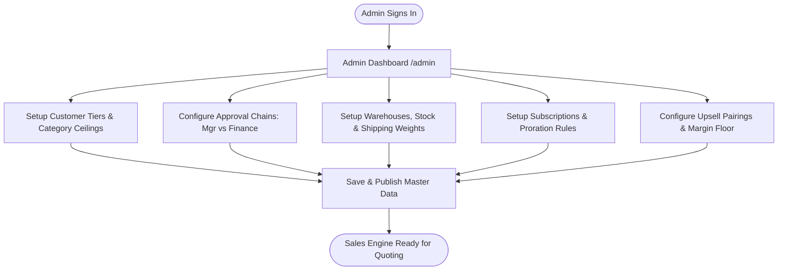
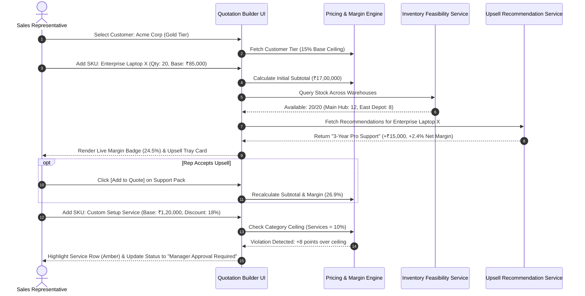
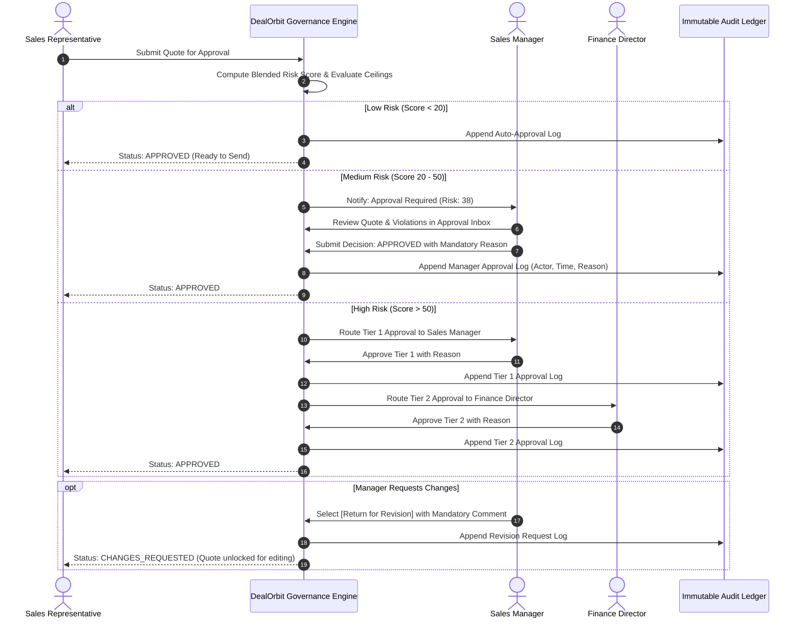
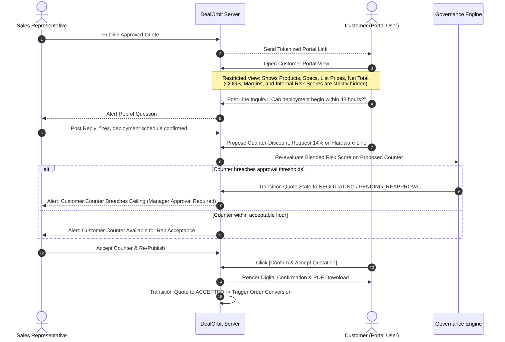
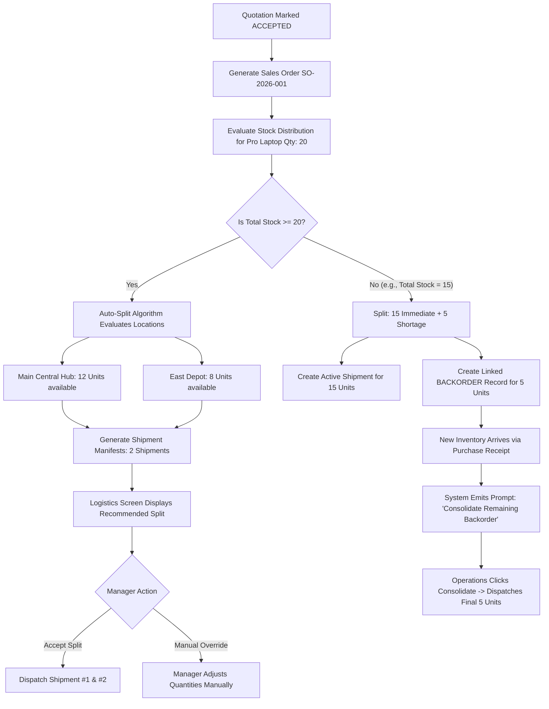
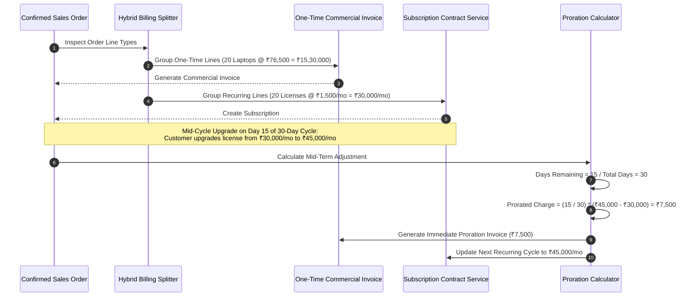
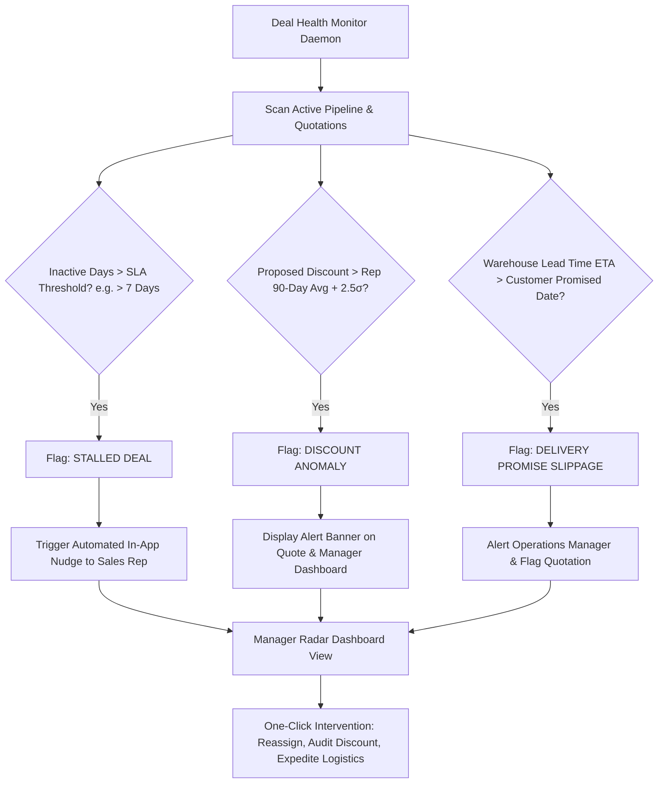

# DealOrbit — User Flows & User Stories Specification

> **Document Version:** 1.1.0  
> **Status:** Base Specification / Validated  
> **Applicable System:** DealOrbit (Intelligent, Self-Governing Sales Operations Platform)  
> **Direct Interoperability:** Implements all functional requirements from `PRD.md` and aligns with the Official Hackathon Specification.

---

## 1. Persona Matrix & System Context

DealOrbit connects five key personas across the entire quotation-to-cash lifecycle. Every persona operates in a purpose-built workspace with strict role-based access control (RBAC):

```
┌─────────────────────────────────────────────────────────────────────────────┐
│                           INTERNAL SALES PLATFORM                           │
├─────────────────┬─────────────────┬───────────────────┬─────────────────────┤
│  SYSTEM ADMIN   │    SALES REP    │   SALES MANAGER   │ FINANCE & LOGISTICS │
│ Master Setup &  │ Deal Strategy & │ Governance, Risk  │ Multi-Warehouse &   │
│ Configurations  │ Living Quotes   │ & Deal Health     │ Hybrid Billing      │
└────────┬────────┴────────┬────────┴─────────┬─────────┴──────────┬──────────┘
         │                 │                  │                    │
         ▼                 ▼                  ▼                    ▼
   [Admin Area]     [Sales Workspace]   [Approval Inbox]    [Logistics & Billing]
   • Pricing/Tiers  • Live Margin Calc  • Blended Risk Gauge • Warehouse Splits
   • Warehouses     • Upsell/Cross-sell • Rep Discount Bench • Backorders
   • Subscriptions  • Strategy Sim      • Health Radar Alerts• Invoices / Proration
                           │
                           │  Secure Magic Link
                           ▼
┌─────────────────────────────────────────────────────────────────────────────┐
│                     RESTRICTED CUSTOMER PORTAL                              │
├─────────────────────────────────────────────────────────────────────────────┤
│                         CUSTOMER PROCUREMENT CONTACT                        │
│   • Specification Review          • Line-Item Inquiries                     │
│   • Counter-Discount Proposals    • One-Click Digital Confirmation          │
│   *(Strictly No Access to Internal Costs, Margins, or Risk Scores)*         │
└─────────────────────────────────────────────────────────────────────────────┘
```

---

## 2. Comprehensive User Stories by Persona

All user stories are structured under the industry-standard **As a... I want to... So that...** format and include explicit **Given-When-Then** acceptance criteria.

---

### 2.1 Persona 1: System Administrator (Admin)

#### US-ADM-01: Configure Customer Discount Tiers & Category Ceilings
* **As an** Admin,
* **I want to** define discount ceilings per customer tier (Bronze $5\%$, Silver $10\%$, Gold $15\%$, Enterprise $20\%$) and set category overrides (Hardware $15\%$, Software $20\%$, Services $10\%$),
* **So that** sales discounting complies with corporate financial and margin policies.
* **Acceptance Criteria:**
  * **Given** an Admin is on `/admin/discount-rules`,
  * **When** the Admin sets Gold tier ceiling to $15\%$ and Services category ceiling to $10\%$ and clicks Save,
  * **Then** the database updates `discount_ceilings` and active validation rules take effect immediately across all new quotations.

#### US-ADM-02: Configure Multi-Tier Approval Chain Thresholds
* **As an** Admin,
* **I want to** define the mathematical thresholds for single-tier (Manager) vs. two-tier (Manager + Finance) approval routing,
* **So that** low-risk deals proceed quickly while severe discount violations are governed by executive finance.
* **Acceptance Criteria:**
  * **Given** an approval routing configuration interface,
  * **When** the Admin sets Blended Risk Score $\le 20 \rightarrow \text{Auto}$, $21-50 \rightarrow \text{Manager}$, $> 50 \rightarrow \text{Manager + Finance}$,
  * **Then** any submitted quotation automatically routes through the configured chain based on its calculated score.

#### US-ADM-03: Setup Warehouses, Stock Levels & Shipping Cost Weights
* **As an** Admin,
* **I want to** register regional warehouses (`Main Central Hub`, `East Depot`, `West Hub`), configure initial stock counts, and set shipping cost weights,
* **So that** the auto-split fulfillment engine can intelligently minimize total shipment count and delivery costs.
* **Acceptance Criteria:**
  * **Given** the `/admin/warehouses` interface,
  * **When** the Admin enters stock counts per SKU and assigns shipping cost multipliers (e.g., Main = 1.0, East = 1.3),
  * **Then** the inventory service utilizes these weights when calculating fulfillment recommendations for orders.

#### US-ADM-04: Configure Subscriptions, Billing Frequencies & Proration
* **As an** Admin,
* **I want to** define recurring billing plans (`Monthly`, `Quarterly`, `Yearly`) and set exact day-count proration rules,
* **So that** recurring software and service contracts generate correct billing schedules.
* **Acceptance Criteria:**
  * **Given** the subscription configuration screen,
  * **When** an Admin configures a monthly plan with a 30-day billing cycle and day-count proration,
  * **Then** mid-cycle contract modifications automatically calculate credits and prorated deltas.

#### US-ADM-05: Configure Upsell/Cross-Sell Pairing Rules & Margin Floor
* **As an** Admin,
* **I want to** configure SKU pairings based on historical co-purchase data, mark priority SKUs as *Promoted*, and establish a minimum margin floor ($18\%$),
* **So that** reps only receive recommendations for profitable, relevant attachments.
* **Acceptance Criteria:**
  * **Given** the `/admin/upsell-rules` configuration view,
  * **When** the Admin pairs `Server Pro` with `3-Year Care Pack` and sets a margin floor of $18\%$,
  * **Then** suggestions that produce net gross margins below $18\%$ are automatically suppressed in the Quotation Builder.

#### US-ADM-06: Sales Performance Reporting & Data Export
* **As an** Admin or Sales Executive,
* **I want to** filter sales metrics by date range, rep, approval status, and product category, and export the dataset to PDF or XLS,
* **So that** I can conduct commercial audits and present sales performance to executive leadership.
* **Acceptance Criteria:**
  * **Given** the `/admin/reports` view,
  * **When** the user applies a filter for *"Last 30 Days"* and clicks **[Export to XLS]**,
  * **Then** the system generates and downloads a structured spreadsheet containing all matching quotes, line discounts, and margins.

---

### 2.2 Persona 2: Sales Representative (Sales Rep)

#### US-REP-01: Build Living Quotation with Multi-Category Lines
* **As a** Sales Rep,
* **I want to** select a customer account and assemble a quotation containing hardware, software, and recurring service lines with dynamic quantities and discounts,
* **So that** I can build complete, comprehensive proposals within a single workspace.
* **Acceptance Criteria:**
  * **Given** a Sales Rep creates a new quotation for `Acme Corp` (Gold Tier),
  * **When** items are added across categories,
  * **Then** the system retrieves customer-tier pricing, computes line totals, and renders an aggregate gross margin badge.

#### US-REP-02: Receive Live Upsell and Cross-Sell Recommendations
* **As a** Sales Rep,
* **I want to** view context-aware upsell and cross-sell cards alongside my cart showing margin delta ($\Delta\%$) and promotional tags,
* **So that** I can expand deal size and improve deal profitability with a single click.
* **Acceptance Criteria:**
  * **Given** a cart containing `Enterprise Laptop X`,
  * **When** the recommendation engine returns `2-Year Care Pack` with $+\Delta 2.4\%$ Margin,
  * **Then** clicking **[Add to Quote]** inserts the item into the cart and immediately updates the quotation subtotal and gross margin badge.

#### US-REP-03: Real-Time Discount Ceiling & Feasibility Feedback
* **As a** Sales Rep,
* **I want** the system to visually flag lines that breach customer or category discount ceilings and alert me to inventory stockouts during quoting,
* **So that** I am immediately aware of operational and governance friction before submitting the deal.
* **Acceptance Criteria:**
  * **Given** a Gold Customer ($15\%$ ceiling) with a Service line ($10\%$ category ceiling),
  * **When** the rep inputs an $18\%$ discount on the Service line,
  * **Then** the line highlights in amber with a warning: *"Exceeds category ceiling by +8 points. Manager approval required."*

#### US-REP-04: Explore Alternatives in the Deal Strategy Simulator (What-If Sandbox)
* **As a** Sales Rep,
* **I want to** launch the Deal Strategy Simulator to test different discount and product configurations against business reality (margin, risk, approvals, shipments) and customer reality (acceptance probability),
* **So that** I can discover the optimal commercial strategy before committing.
* **Acceptance Criteria:**
  * **Given** a quote with high risk ($15\%$ discount, $14.2\%$ margin, $48\%$ acceptance probability),
  * **When** the rep opens the simulator,
  * **Then** DealOrbit displays Scenario A (Status Quo), Scenario B (Recommended: $10\%$ discount + 2-Yr Care Pack, $21.5\%$ margin, $68\%$ acceptance), and Scenario C (Margin Preservation).
  * **When** the rep clicks **[Apply Scenario B]**,
  * **Then** the active quotation cart updates to reflect Scenario B's lines, discounts, and terms.

#### US-REP-05: Submit Quotation for Automated Approval Routing
* **As a** Sales Rep,
* **I want to** submit a quotation and have DealOrbit calculate the Blended Risk Score and route it to the appropriate manager without manual email follow-up,
* **So that** review cycles are streamlined and transparent.
* **Acceptance Criteria:**
  * **Given** a quote with an $18\%$ service discount (Blended Risk Score: 38),
  * **When** the rep clicks **[Submit for Review]**,
  * **Then** the quote transitions to `IN_REVIEW` and automatically appears in the Sales Manager's approval queue.

#### US-REP-06: Publish Approved Quote to Restricted Customer Portal
* **As a** Sales Rep,
* **I want to** publish an approved quote to a secure customer portal and generate a shareable tokenized link,
* **So that** the customer can review and negotiate the deal in a secure, interactive environment.
* **Acceptance Criteria:**
  * **Given** an `APPROVED` quotation,
  * **When** the rep clicks **[Publish to Portal]**,
  * **Then** a unique portal URL is generated, the status moves to `CUSTOMER_REVIEW`, and the customer receives an invitation.

#### US-REP-07: Respond to Customer Inquiries & Counter-Offers
* **As a** Sales Rep,
* **I want to** view line-level questions and counter-discount proposals submitted by the customer and respond directly within the workspace,
* **So that** negotiation happens quickly and maintains a complete audit trail.
* **Acceptance Criteria:**
  * **Given** a customer submits a counter-offer on line 1 for $14\%$ discount,
  * **When** the rep opens the negotiation thread,
  * **Then** DealOrbit displays the customer's comment, recalculated deal margins, and prompts the rep to accept, reject, or revise.

---

### 2.3 Persona 3: Sales Manager / Approver

#### US-MGR-01: Review Out-of-Policy Quotes in the Approval Inbox
* **As a** Sales Manager,
* **I want an** approval inbox showing pending quotations, calculated Blended Risk Scores, line-level ceiling breaches, and rep historical discount benchmarks,
* **So that** I can make informed commercial sign-off decisions rapidly.
* **Acceptance Criteria:**
  * **Given** the `/approvals` inbox,
  * **When** a manager clicks on a pending quote for Acme Corp,
  * **Then** the screen renders the Blended Risk Score gauge, itemized violations, the rep's 90-day average discount ($9.2\%$), and the proposed discount ($14\%$).

#### US-MGR-02: Approve, Reject, or Request Changes with Mandatory Audit Logging
* **As a** Sales Manager,
* **I want to** approve, reject, or return quotes for revision with a mandatory comment field,
* **So that** corporate governance is strictly audited with full accountability.
* **Acceptance Criteria:**
  * **Given** a pending quote review,
  * **When** the manager selects **[Approve with Reason]** and inputs *"Strategic renewal account; margin compensated by recurring contract"*,
  * **Then** the quote state transitions to `APPROVED`, an immutable audit record is committed (`Actor`, `Timestamp`, `Reason`), and the rep is notified.

#### US-MGR-03: Monitor Team Deal Health & Pipeline Momentum
* **As a** Sales Manager,
* **I want a** Deal Health Dashboard that automatically detects stalled quotes ($>7$ days without activity), discount anomalies ($>2.5\sigma$), and delivery promise slippage,
* **So that** I can proactively coach reps and eliminate deal bottlenecks before momentum is lost.
* **Acceptance Criteria:**
  * **Given** the `/deal-health` radar view,
  * **When** a quote in `CUSTOMER_REVIEW` has had zero interaction for 8 days,
  * **Then** it is highlighted as `STALLED DEAL` with a one-click **[Send Nudge]** action.

#### US-MGR-04: Trigger Escalation Actions for High-Risk Deals
* **As a** Sales Manager,
* **I want to** escalate deals flagged with severe delivery slippage or excessive discounting directly to executive leadership,
* **So that** cross-departmental alignment is resolved before contract signing.
* **Acceptance Criteria:**
  * **Given** an anomaly alert on a flagship enterprise deal,
  * **When** the manager clicks **[Escalate to VP/Finance]**,
  * **Then** an urgent notification is dispatched with the full commercial and logistics risk breakdown attached.

---

### 2.4 Persona 4: Finance & Operations / Logistics

#### US-OPS-01: Two-Tier High-Risk Discount Approval
* **As a** Finance Director,
* **I want to** review quotations that have passed Manager approval but carry a Blended Risk Score $> 50$,
* **So that** gross margin leakage and cash-flow exposures are vetted by corporate finance.
* **Acceptance Criteria:**
  * **Given** a quotation approved by Sales Manager with Risk Score $= 58$,
  * **When** the Finance Director reviews the margin breakdown and clicks **[Approve]**,
  * **Then** the quotation advances to `APPROVED` and unlocks customer publishing.

#### US-OPS-02: Auto-Split Orders Across Multiple Regional Warehouses
* **As an** Operations Manager,
* **I want** DealOrbit to automatically calculate the optimal warehouse split for confirmed orders based on live stock and shipping cost weighting,
* **So that** orders are fulfilled with the minimum number of shipments and logistics cost.
* **Acceptance Criteria:**
  * **Given** an order for 20 Laptops where Main Hub has 12 and East Depot has 8,
  * **When** the system evaluates fulfillment,
  * **Then** it generates an automated split: Shipment #1 (Main Hub: 12 units), Shipment #2 (East Depot: 8 units).

#### US-OPS-03: Manual Warehouse Split Override
* **As an** Operations Manager,
* **I want to** manually override the auto-split allocation when local logistical factors (e.g., dock maintenance or local carrier delays) dictate an alternate split,
* **So that** human operational context can govern exceptions.
* **Acceptance Criteria:**
  * **Given** an auto-split recommendation,
  * **When** the manager clicks **[Manual Override]** and reallocates 10 units to West Hub,
  * **Then** the shipment manifests update immediately, and an audit note is appended.

#### US-OPS-04: Manage Backorders & Consolidate Remaining Stock
* **As an** Operations Manager,
* **I want** inventory shortages to generate linked `BACKORDER` records, and when replenishment stock arrives, display a **"Consolidate Remaining Backorder"** prompt,
* **So that** pending customer balances are fulfilled immediately without manual re-entry.
* **Acceptance Criteria:**
  * **Given** an order for 20 units with only 15 available,
  * **When** the initial 15 units are dispatched, a linked Backorder for 5 units is created.
  * **When** new inventory arrives via PO receipt,
  * **Then** the operations screen displays a **"Consolidate Remaining Backorder"** button; clicking it generates the final fulfillment dispatch.

#### US-OPS-05: Split Hybrid Invoicing (One-Time Invoice + Subscription Schedule)
* **As a** Finance / Billing Clerk,
* **I want** an order with mixed one-time hardware and recurring software/support lines to automatically generate an immediate commercial invoice and a linked recurring subscription contract,
* **So that** billing and revenue recognition are accurate without manual reconciliation.
* **Acceptance Criteria:**
  * **Given** an order with ₹10,00,000 hardware and ₹25,000/month recurring support,
  * **When** the order is confirmed,
  * **Then** DealOrbit creates Invoice `#INV-XXXX` (₹10,00,000, Status: `SENT`) and Subscription `#SUB-XXXX` (Monthly billing schedule starting on the 1st).

#### US-OPS-06: Mid-Cycle Subscription Proration & Credit Notes
* **As a** Finance / Billing Clerk,
* **I want** mid-cycle subscription tier upgrades or cancellations to automatically calculate exact day-count proration and generate adjustment invoices or credit notes,
* **So that** customer accounts reflect exact usage without mathematical error.
* **Acceptance Criteria:**
  * **Given** an active ₹30,000/mo subscription upgraded to ₹45,000/mo on Day 15 of a 30-day month,
  * **When** the modification is saved,
  * **Then** the proration engine charges $(15/30) \times (45,000 - 30,000) = ₹7,500$ on an immediate proration invoice.

---

### 2.5 Persona 5: Customer Procurement Contact (Portal User)

#### US-CUST-01: Access Restricted Portal View via Secure Token Link
* **As a** Customer Procurement Contact,
* **I want to** access my quotation via a secure tokenized link without creating complex internal accounts,
* **So that** I can review proposals effortlessly from any device.
* **Acceptance Criteria:**
  * **Given** an email invitation with a secure token link,
  * **When** the customer clicks the link,
  * **Then** the portal loads displaying products, specifications, quantities, list prices, and discounts, with internal costs and margins strictly omitted.

#### US-CUST-02: Submit Line-Level Questions and Change Requests
* **As a** Customer Procurement Contact,
* **I want to** post questions or request quantity adjustments on specific line items directly within the portal,
* **So that** inquiries are contextualized rather than buried in email threads.
* **Acceptance Criteria:**
  * **Given** the customer portal view,
  * **When** the customer clicks on the "Custom Setup Service" row and posts *"Can installation be completed over the weekend?"*,
  * **Then** the comment is posted to the thread and the sales rep receives an immediate notification.

#### US-CUST-03: Submit Counter-Discount Proposal
* **As a** Customer Procurement Contact,
* **I want to** enter a counter-discount percentage or propose adjusted payment terms,
* **So that** commercial negotiations are conducted transparently through the platform.
* **Acceptance Criteria:**
  * **Given** a quote with a $12\%$ hardware discount,
  * **When** the customer inputs a counter-discount of $15\%$ and clicks **[Submit Request]**,
  * **Then** the quote status updates to `NEGOTIATING`, the rep is notified, and DealOrbit triggers governance re-evaluation.

#### US-CUST-04: Digital One-Click Quotation Confirmation
* **As a** Customer Procurement Contact,
* **I want to** digitally sign and accept the agreed quotation with one click,
* **So that** the deal is executed immediately and moves to fulfillment.
* **Acceptance Criteria:**
  * **Given** an agreed quotation in the portal,
  * **When** the customer clicks **[Confirm & Accept Quotation]**,
  * **Then** the quotation transitions to `ACCEPTED`, an official PDF confirmation is generated, and the internal order conversion flow triggers.

---

## 3. Step-by-Step User Flows (Detailed State Machines & Sequence Diagrams)

---

### 3.1 Flow 1: System Admin Master Configuration Flow



#### Detailed Execution Steps:
1. **Sign-in & Navigation:** Admin navigates to `/admin` and selects the configuration workspace.
2. **Discount Ceilings Definition:**
   * Customer Tiers: Bronze ($5\%$), Silver ($10\%$), Gold ($15\%$), Enterprise ($20\%$).
   * Category Limits: Hardware ($15\%$), Software ($20\%$), Services ($10\%$).
3. **Approval Chain Setup:**
   * Rule 1: Line overage $\le 0\%$ AND Risk Score $< 20 \rightarrow$ Auto-Approve.
   * Rule 2: Line overage $> 0\%$ OR Risk Score $20 - 50 \rightarrow$ Manager Approval.
   * Rule 3: Line overage $> 10\%$ OR Risk Score $> 50 \rightarrow$ Manager $\rightarrow$ Finance.
4. **Logistics & Warehouses:**
   * Registers Main Central Hub (Shipment Weight multiplier: 1.0), East Depot (1.3), West Hub (1.5).
   * Sets starting stock counts for all demo SKUs.
5. **Subscription & Upsell Policies:**
   * Establishes Monthly, Quarterly, and Annual billing rules with exact day-count proration.
   * Links `Enterprise Laptop X` to `3-Year Pro Support Pack` with promotional boost flag and minimum margin threshold $= 18\%$.

---

### 3.2 Flow 2: Living Quotation Assembly & Live Feedback Flow (Sales Rep)



#### Detailed State Transition:
* Initial State: `NEW_QUOTE` (Draft).
* Customer Selection: `DRAFT_INITIALIZED` (Customer terms, tier ceilings loaded).
* Items Added: `DRAFT_ACTIVE` (Real-time subtotal, margin calculation active).
* Rule Violation Triggered: `DRAFT_GOVERNED` (Risk indicators highlighted, submission warnings displayed).

---

### 3.3 Flow 3: Deal Strategy Sandbox & Dual-Sided Simulation Flow (The Innovation Layer)

```mermaid
graph TD
    A[Rep clicks 'Simulate Deal Strategy'] --> B[Deal Strategy Engine Ingests Active Cart]
    B --> C[Business-Side Simulation]
    B --> D[Customer-Side Simulation]
    
    C --> C1[Net Margin: 14.2%]
    C --> C2[Blended Risk Score: 56 High]
    C --> C3[Required Approvals: Mgr + Finance]
    C --> C4[Logistics: 2 Shipments Required]
    
    D --> D1[Load Grounded Profile: Acme Corp]
    D --> D2[Historical Discount Corridor: 8-12%]
    D --> D3[Service Price Elasticity: Low]
    D --> D4[Predicted Probabilities: Accept 48%, Counter 42%, Reject 10%]
    
    C & D --> E[Strategy Synthesizer Computes 3 Scenarios]
    E --> SA[Scenario A: Status Quo - 15% Disc | High Latency]
    E --> SB[Scenario B: Recommended - 10% Disc + 2Yr Care | Fast Close]
    E --> SC[Scenario C: Margin Defense - 7% Disc + Prem Support | Zero Approval]
    
    SA & SB & SC --> F[Side-by-Side Trade-off Comparison Matrix]
    F --> G[Rep Selects Scenario B]
    G --> H[One-Click Apply Updates Active Quote Lines & Terms]
```

#### Strategic Value Loop:
1. **Understanding:** DealOrbit evaluates current quote parameters ($15\%$ discount, $14.2\%$ margin, high risk score, two-tier approval requirement).
2. **Customer Simulation:** Compares proposed discount against Acme Corp's empirical accepted discount corridor ($8\% - 12\%$). Since $15\%$ exceeds this corridor, predicted counter-negotiation probability is $42\%$ and immediate acceptance is only $48\%$.
3. **Recommendation:** DealOrbit recommends **Scenario B**:
   * Hardware discount reduced to $10\%$ (within historical corridor).
   * Bundles a 2-Year Care Pack at $5\%$ promotional discount.
   * Net Margin increases to $21.5\%$ ($+730\text{ bps}$).
   * Finance approval is eliminated; requires only Sales Manager approval.
   * Customer acceptance probability jumps to $68\%$.
4. **Execution:** Rep clicks **[Apply Scenario B]**; active cart lines update instantly.

---

### 3.4 Flow 4: Discount Governance & Multi-Tier Approval Workflow



#### Invalidation & Re-Evaluation Rule:
If a Sales Rep or Customer edits any line item, discount, or quantity on an `APPROVED` quotation:
1. The prior approval record is marked `REVOKED_BY_MUTATION`.
2. The quotation status automatically reverts to `DRAFT` or `IN_REVIEW`.
3. The Blended Risk Score is recomputed from the updated cart.

---

### 3.5 Flow 5: Customer Portal Negotiation & Self-Governing Re-evaluation



---

### 3.6 Flow 6: Order Conversion, Multi-Warehouse Splitting & Backorders



#### Auto-Split Cost Weighting Formulation:
For an order requiring quantity $Q$, the auto-split algorithm minimizes total fulfillment cost:
$$\min \sum_{w \in W} \left( \mathbb{I}(q_w > 0) \cdot \text{BaseShipmentCost} \times \text{Weight}_w \right) \quad \text{subject to} \quad \sum_{w \in W} q_w = Q \quad \text{and} \quad q_w \le \text{Stock}_w$$
Where:
* $W$ is the set of registered warehouses.
* $\mathbb{I}(q_w > 0)$ is an indicator variable penalizing each additional shipment.
* $\text{Weight}_w$ is the warehouse-specific logistics cost multiplier configured by the Admin.

---

### 3.7 Flow 7: Hybrid Billing, Subscriptions & Mid-Term Proration



---

### 3.8 Flow 8: Deal Health Radar, Anomaly Detection & Escalations



---

## 4. Official 8-Step Quick Test Flow (Step-by-Step Verification Blueprint)

This flow maps 1-to-1 with **Section 9 (Quick Test Flow)** of the official Hackathon Specification. Passing each step verifies the authentic functioning of DealOrbit's core business logic:

| Step | User / Actor | Exact Action Performed | Expected Visual & System Result | Validation Status |
| :---: | :--- | :--- | :--- | :---: |
| **1** | Admin | Sign up/log in; configure Gold Tier ($15\%$), Main + East Warehouses, and Monthly Subscription Plan. | Records created in `tiers`, `warehouses`, and `subscription_plans`. | `READY` |
| **2** | Sales Rep | Create quote for Gold Customer; add Service line with $18\%$ discount ($> 10\%$ category ceiling). | Service line flagged in amber; Blended Risk Score updates; status indicates *"Manager Approval Required"*. | `VERIFIED` |
| **3** | Sales Rep | Click **[Submit for Approval]**. | Quote moves to `IN_REVIEW`; automatically appears in Sales Manager approval inbox without manual rep request. | `VERIFIED` |
| **4** | Sales Rep | Open Upsell tray alongside cart and click **[Add to Quote]** on a suggested 3-Year Support package. | Order total, gross margin badge, and recurring ARR update immediately in the summary header. | `VERIFIED` |
| **5** | Sales Manager | Log in, review quote in inbox, and click **[Approve with Reason]** (*"Strategic account approved"*). | State changes to `APPROVED`; system generates recommended warehouse split (12 from Main Hub, 8 from East Depot). | `VERIFIED` |
| **6** | Sales Rep | Click **[Convert to Order]**. | System generates two linked records: Commercial Invoice for one-time hardware and recurring Subscription schedule for support. | `VERIFIED` |
| **7** | Customer | Open Customer Portal via token link; submit counter-discount of $20\%$ on hardware line. | Quote immediately transitions to `NEGOTIATING`; prior approval is revoked; re-enters Manager approval queue automatically. | `VERIFIED` |
| **8** | Customer & Finance | Customer accepts final terms; Finance records payment. | Order confirmed; invoice marked `PAID`; warehouse split manifests marked `READY_FOR_PICKING`. | `COMPLETE` |

---

## 5. Edge Cases & Exception Handling Matrix

| Scenario / Edge Case | System Behavior & Defensive Rule | User Notification & UI State |
| :--- | :--- | :--- |
| **Simultaneous Rep & Customer Edits** | Optimistic concurrency control via `version` column. | The second submitter receives: *"Quote was updated by [User]. Please review latest version before submitting."* |
| **Zero Inventory Across All Warehouses** | All requested quantities are allocated to a `BACKORDER` manifest. | Amber badge: *"100% Backorder. Expected replenishment in X days."* Quote remains valid. |
| **Approval Chain Loophole (Multiple Small Violations)** | The Blended Risk Score formula sums margin leakage across all lines. | Multiple $+2\%$ breaches accumulate into a high risk score, routing to Manager even if no single line breaches heavily. |
| **Customer Counters Outside Allowed Margin Floor** | System flags deal as commercially non-viable ($< \text{Margin Floor}$). | Warning banner: *"Customer counter breaches company margin floor (12%). Rep override requires Finance approval."* |
| **Mid-Cycle Plan Downgrade with Pre-Paid Term** | Proration engine computes negative delta and generates an official Credit Note. | Credit Note `#CN-XXXX` issued with balance applied to customer account ledger. |

---

## 6. Document Interoperability & Next Steps

With `PRD.md` and `User_flows.md` finalized and verified:
1. `PRD.md` — Authoritative Product Requirements & Core Philosophy.
2. `User_flows.md` — Comprehensive User Stories & Step-by-Step Interaction State Machines.
3. **`Architecture.md`** *(Next Up)* — Clean Layered Backend Architecture (Express/Prisma), Frontend Next.js 16 Structure, Simulation Engine, State Management, and DevOps.
4. `Database.md` — Complete PostgreSQL Schema, Prisma Models, Enums, Relationships, and Seed Definitions.
5. `API.md` — RESTful Endpoints, Request/Response Payloads, Validation Schemas, and Error Handling.
6. `Features.md` — Granular Functional Matrix and Acceptance Test Cases.
7. `Memory.md` — Session State, Audit Ledger Storage, Simulation Caching, and Persistence Conventions.
8. `Pages.md` — Frontend Route Trees, Page Layouts, and Component Hierarchy.
